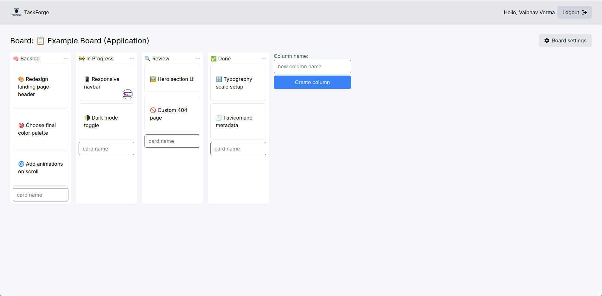
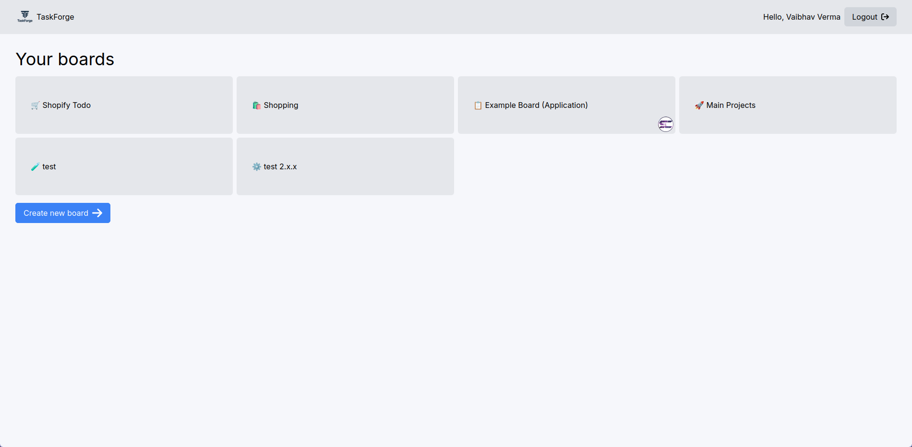
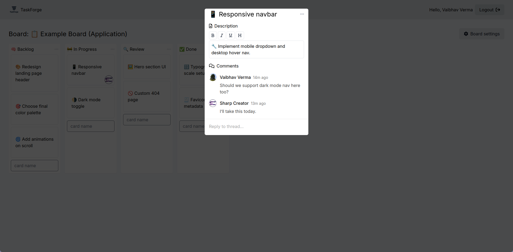

# 🧠 TaskForge

**TaskForge** is a sleek, real-time collaborative Kanban board built using modern technologies like Next.js, Tailwind CSS, and Liveblocks. Designed for teams, freelancers, or individuals to manage projects intuitively and efficiently.

<p align="center">
  
</p>

---

## 🚀 Features

- 📝 Create, edit, and delete tasks
- 🧲 Drag-and-drop cards across columns
- 🧑‍🤝‍🧑 Real-time collaboration with Liveblocks
- 🧵 Comment threads and discussions on tasks
- 📎 Attachments & avatars (Google Auth enabled)
- 🌙 Clean, responsive UI
- 🔐 Secure authentication with NextAuth.js

---

## 🛠️ Tech Stack

| Technology     | Purpose                         |
|----------------|----------------------------------|
| [Next.js](https://nextjs.org/)        | React framework for SSR & routing |
| [Tailwind CSS](https://tailwindcss.com/) | Utility-first styling             |
| [Liveblocks](https://liveblocks.io/)   | Real-time collaboration            |
| [NextAuth.js](https://next-auth.js.org/) | Authentication (Google OAuth)     |
| [MongoDB](https://mongodb.com/)       | Database for storing board data   |

---

## 📸 Screenshots

| Dashboard | Board View | Card Modal |
|----------|------------|------------|
|  |  |  |

> ℹ️ Place your screenshots in the `public/screenshots/` directory.

---

## ⚙️ Installation

```bash
# Clone the repo
git clone https://github.com/your-username/taskforge.git
cd taskforge

# Install dependencies
npm install

# Create environment variables
cp .env.example .env.local
